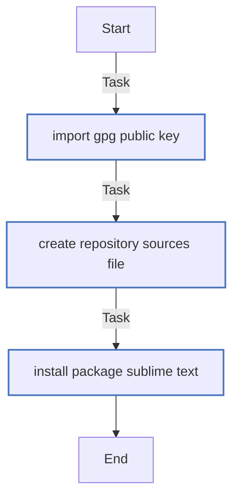
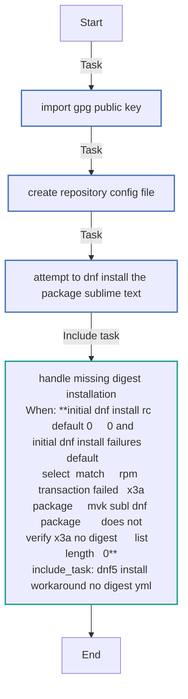
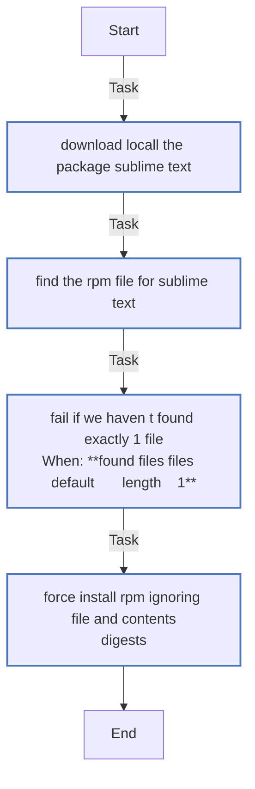
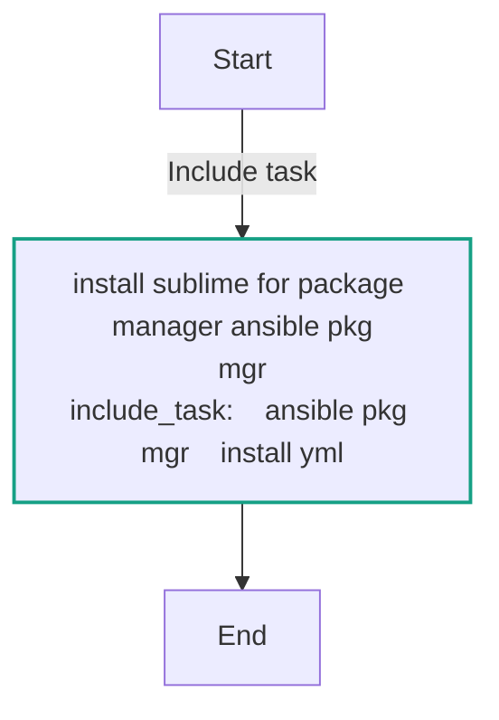

<!-- DOCSIBLE START -->

# 📃 Role overview

## mvk_subl

Description: Install Sublime Text editor

### Defaults

**These are static variables with lower priority**

#### File: defaults/main.yml

| Var          | Type         | Value       |
|--------------|--------------|-------------|
| [mvk_subl_release](defaults/main.yml#L4)   | str | `stable` |    
| [mvk_subl_server](defaults/main.yml#L5)   | str | `https://download.sublimetext.com` |    
| [mvk_subl_dnf_package](defaults/main.yml#L6)   | str | `sublime-text` |    
| [mvk_subl_dnf_key](defaults/main.yml#L7)   | str | `sublimehq-rpm-pub.gpg` |    
| [mvk_subl_dnf_repo](defaults/main.yml#L8)   | str | `rpm/{{ mvk_subl_release }}/{{ ansible_architecture }}/{{ mvk_subl_dnf_package }}.repo` |    
| [mvk_subl_apt_key](defaults/main.yml#L11)   | str | `sublimehq-pub.gpg` |    
| [mvk_subl_apt_key_path](defaults/main.yml#L12)   | str | `/etc/apt/keyrings/sublimehq-pub.asc` |    
| [mvk_subl_apt_repo_path](defaults/main.yml#L13)   | str | `etc/apt/sources.list.d/{{ mvk_subl_dnf_package }}.sources` |    

### Tasks

#### File: tasks/apt/install.yml

| Name | Module | Has Conditions |
| ---- | ------ | -------------- |
| Import gpg public key | ansible.builtin.get_url | False |
| Create repository sources file | ansible.builtin.template | False |
| Install package sublime-text | ansible.builtin.apt | False |

#### File: tasks/dnf5/install.yml

| Name | Module | Has Conditions |
| ---- | ------ | -------------- |
| Import gpg public key | ansible.builtin.shell | False |
| Create repository config file | ansible.builtin.shell | False |
| Attempt to dnf install the package sublime-text | ansible.builtin.dnf | False |
| Handle missing digest installation | ansible.builtin.include_tasks | True |

#### File: tasks/dnf5/install_workaround_no_digest.yml

| Name | Module | Has Conditions |
| ---- | ------ | -------------- |
| Download locall the package sublime-text | ansible.builtin.command | False |
| Find the RPM file for sublime-text | ansible.builtin.find | False |
| Fail if we haven't found exactly 1 file | ansible.builtin.fail | True |
| Force install RPM ignoring file and contents digests | ansible.builtin.command | False |

#### File: tasks/main.yml

| Name | Module | Has Conditions |
| ---- | ------ | -------------- |
| Install sublime for package manager {{ ansible_pkg_mgr }} | ansible.builtin.include_tasks | False |

## Task Flow Graphs

### Graph for apt/install.yml

### Graph for dnf5/install.yml

### Graph for dnf5/install_workaround_no_digest.yml

### Graph for main.yml

## Author Information
Max Kovgan

#### License

MIT

#### Minimum Ansible Version

2.1

#### Platforms

- **Fedora**: [42, 43]
- **Debian**: ['bookworm', 'bullseye']
- **Ubuntu**: ['noble', 'plucky', 'questing']

#### Dependencies

No dependencies specified.
<!-- DOCSIBLE END -->
